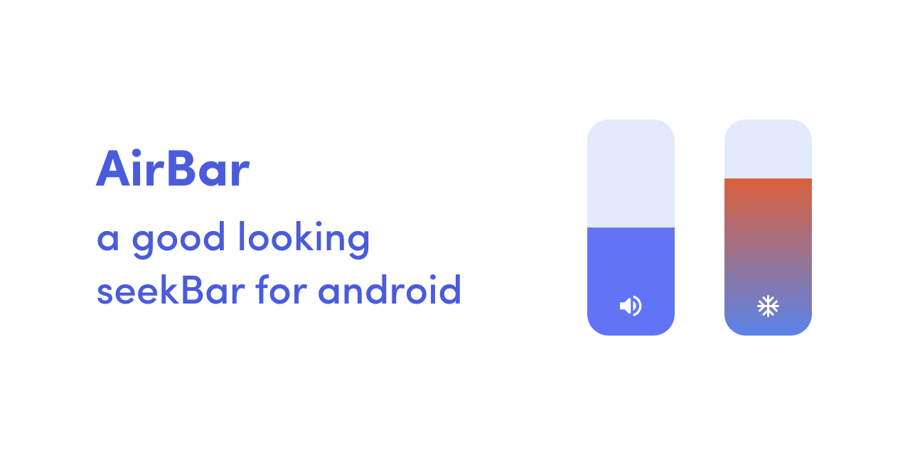

# AirBar
<p align="center"></p>

[](https://jitpack.io/#5hahryar/AirBar)
[](https://www.android.com)
[](https://android-arsenal.com/api?level=21)

# Usage
``` 
allprojects {
		repositories {
			...
			maven { url 'https://jitpack.io' }
		}
	}
  ```
```
dependencies {
		implementation 'com.github.5hahryar:AirBar:1.1.0'
	}
  ```
  
  ### XML
  ```
  <com.shahryar.airbar.AirBar
        android:id="@+id/airbar"
        android:layout_width="70dp"
        android:layout_height="200dp"/>
  ```
  
  ### Listener
  ```
  airbar.setOnProgressChangedListener(object : AirBar.OnProgressChangedListener{
            override fun onProgressChanged(airBar: AirBar, progress: Double, percentage: Double) {
                //Write your code
            }

            override fun afterProgressChanged(airBar: AirBar, progress: Double, percentage: Double) {
                //Write your code
            }
        })
  ```
  
  # Attributes
  Attribute | Functionality
  ------------ | ------------- 
  progressBarFillColor | Set color for level indicator
  progressBarColor0 | Set gradient color for bottom of the view
  progressBarColor1 | Set gradient color for top of the view
  backgroundFillColor | Set background color
  backgroundCornerRadius | Set corner radius 
  icon | Set icon
  max | Set Maximum value 
  min | Set minimum value
  
  # License
  AirBar is licensed under `MIT license`. View [license](LICENSE).
